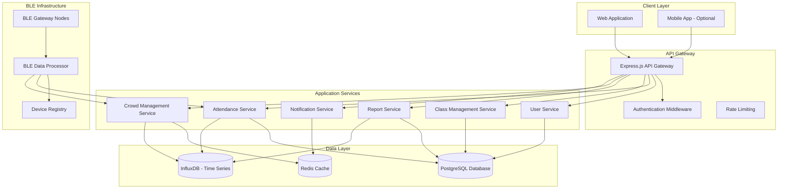

# Darbaan Smart Attendance System - Design Document

## Overview

Darbaan is a web-based smart attendance and crowd management system that leverages Bluetooth Low Energy (BLE) technology for automatic presence detection. The system provides a responsive web interface serving three user roles with distinct access levels and functionality. The architecture emphasizes real-time data processing, scalable BLE device management, and comprehensive reporting capabilities.

## Architecture

### System Architecture



### Technology Stack

**Frontend:**
- React.js with TypeScript for type safety
- Material-UI or Tailwind CSS for responsive design
- Chart.js for dashboard visualizations and pie charts
- Socket.io client for real-time updates
- React Router for navigation and login page routing

**Backend:**
- Node.js with Express.js framework
- TypeScript for type safety
- Socket.io for real-time communication
- JWT for authentication
- Bcrypt for password hashing

**BLE Infrastructure:**
- Raspberry Pi Model B (4GB RAM) as primary BLE gateway
- BLE tags for device identification
- Noble.js for BLE scanning (Node.js)
- MQTT for BLE gateway communication
- Optimized for Raspberry Pi hardware constraints

**Databases:**
- PostgreSQL for relational data (users, classes, relationships)
- Redis for caching and real-time data
- InfluxDB for time-series attendance and crowd data

## Components and Interfaces

### Frontend Components

#### Dashboard Component
- **AttendanceMetrics**: Displays total students, present today, late arrivals, attendance rate
- **NotificationCenter**: Top-right notification panel with real-time updates
- **QuickActions**: Common administrative actions
- **AttendanceChart**: Visual representation of attendance trends

#### Student Management Component
- **StudentList**: Paginated table with student information
- **StudentFilter**: Filter by class enrollment with search functionality
- **StudentForm**: Add/edit student modal with validation
- **ExportOptions**: CSV and Excel export functionality

#### Class Management Component
- **ClassList**: Grid or list view of all classes
- **ClassForm**: Create/edit class modal
- **ClassDetails**: Detailed view with enrolled students
- **ClassActions**: Edit/delete operations with confirmation

#### Reports Component
- **ReportTypeSelector**: Dropdown for daily, weekly, monthly, and custom range reports
- **DateRangeSelector**: Start date and end date picker components
- **FilterControls**: Apply filters button and filter reset functionality
- **ReportAnalytics**: Display total students, average attendance, total classes, punctuality rate
- **AttendanceTrends**: Line chart showing attendance trends over selected period
- **AttendanceDistribution**: Pie chart showing present, late, and absent distribution
- **ExportOptions**: Multiple format export (PDF, CSV, Excel)

#### Crowd Management Component
- **CampusOverview**: Dashboard showing total locations (4), total occupancy, total capacity, active alerts
- **LocationCards**: Individual cards for Food Street, Rock Plaza, Central Library, Main Auditorium
- **RealTimeOccupancy**: Live crowd density display for each location
- **CrowdHeatmap**: Visual representation of crowd distribution across locations
- **AlertPanel**: Location-specific crowd density alerts and warnings
- **HistoricalData**: Crowd patterns over time for each location

### Backend Services

#### User Service
```typescript
interface UserService {
  authenticate(credentials: LoginCredentials): Promise<AuthResult>
  createUser(userData: CreateUserRequest): Promise<User>
  updateUser(userId: string, updates: UpdateUserRequest): Promise<User>
  getUsersByRole(role: UserRole): Promise<User[]>
  registerBLEDevice(userId: string, deviceInfo: BLEDevice): Promise<void>
}
```

#### Attendance Service
```typescript
interface AttendanceService {
  recordEntry(deviceId: string, timestamp: Date, location: string): Promise<void>
  recordExit(deviceId: string, timestamp: Date, location: string): Promise<void>
  getAttendanceByDate(date: Date, classId?: string): Promise<AttendanceRecord[]>
  calculateAttendanceRate(period: DateRange, filters: AttendanceFilters): Promise<number>
  markLateArrival(userId: string, arrivalTime: Date): Promise<void>
}
```

#### BLE Processing Service
```typescript
interface BLEProcessor {
  processBeaconData(beaconData: BLEBeacon): Promise<void>
  registerDevice(deviceInfo: BLEDevice): Promise<string>
  updateDeviceStatus(deviceId: string, status: DeviceStatus): Promise<void>
  getActiveDevices(location?: string): Promise<BLEDevice[]>
}
```

## Data Models

### Core Entities

#### User Model
```typescript
interface User {
  id: string
  email: string
  firstName: string
  lastName: string
  role: 'student' | 'faculty' | 'admin'
  studentId?: string // For students
  employeeId?: string // For faculty/admin
  enrolledClasses?: string[] // Class IDs for students
  bleDevices: BLEDevice[]
  isActive: boolean
  createdAt: Date
  updatedAt: Date
}
```

#### Class Model
```typescript
interface Class {
  id: string
  name: string
  code: string
  description?: string
  instructor: string // User ID
  schedule: ClassSchedule[]
  enrolledStudents: string[] // User IDs
  maxCapacity: number
  location: string
  isActive: boolean
  createdAt: Date
  updatedAt: Date
}
```

#### Attendance Record Model
```typescript
interface AttendanceRecord {
  id: string
  userId: string
  classId?: string
  entryTime: Date
  exitTime?: Date
  location: string
  isLateArrival: boolean
  attendanceStatus: 'present' | 'absent' | 'late' | 'partial'
  deviceId: string
  createdAt: Date
}
```

#### BLE Device Model
```typescript
interface BLEDevice {
  id: string
  userId: string
  macAddress: string
  deviceName: string
  deviceType: 'smartphone' | 'wearable' | 'beacon'
  isActive: boolean
  lastSeen: Date
  batteryLevel?: number
  signalStrength?: number
}
```

#### Crowd Data Model
```typescript
interface CrowdData {
  id: string
  location: 'food-street' | 'rock-plaza' | 'central-library' | 'main-auditorium'
  timestamp: Date
  occupancyCount: number
  maxCapacity: number
  occupancyRate: number
  alertLevel: 'normal' | 'warning' | 'critical'
  activeDevices: string[] // Device IDs
}
```

#### System Settings Model
```typescript
interface SystemSettings {
  id: string
  category: 'general' | 'attendance' | 'notifications' | 'security' | 'system'
  
  // General Settings
  systemName?: string
  timezone?: string
  language?: string
  dateFormat?: string
  enableBackups?: boolean
  
  // Attendance Settings
  lateThresholdMins?: number
  absentThresholdMins?: number
  cooldownPeriodSecs?: number
  enableManualEntry?: boolean
  
  // Notification Settings
  emailNotifications?: boolean
  smsNotifications?: boolean
  pushNotifications?: boolean
  dailyReports?: boolean
  securityAlerts?: boolean
  
  // Security Settings
  sessionTimeoutMins?: number
  passwordExpiryDays?: number
  twoFactorAuth?: boolean
  dataEncryption?: boolean
  auditLogs?: boolean
  
  // System Settings
  syncIntervalMins?: number
  logLevel?: 'debug' | 'info' | 'warning' | 'error'
  autoSync?: boolean
  offlineMode?: boolean
  debugMode?: boolean
  
  updatedBy: string
  updatedAt: Date
}
```

### Database Schema Design

#### PostgreSQL Tables
- **users**: Core user information and authentication
- **classes**: Class definitions and metadata
- **class_enrollments**: Many-to-many relationship between users and classes
- **ble_devices**: BLE device registry linked to users
- **locations**: Physical locations for crowd management
- **system_settings**: Application configuration

#### InfluxDB Measurements
- **attendance_events**: Time-series attendance data
- **crowd_occupancy**: Real-time and historical crowd data
- **device_signals**: BLE signal strength and connectivity data

## Error Handling

### BLE Communication Errors
- **Device Not Found**: Graceful handling when registered devices are not detected
- **Signal Interference**: Retry mechanisms for weak or intermittent signals
- **Gateway Connectivity**: Fallback procedures when BLE gateways are offline
- **Device Battery Low**: Notifications and alternative tracking methods

### Data Consistency
- **Duplicate Entry Prevention**: Ensure single entry/exit records per time window
- **Time Synchronization**: Handle clock drift between BLE gateways
- **Missing Exit Records**: Automatic cleanup for incomplete attendance sessions
- **Concurrent Access**: Database-level locking for critical operations

### User Experience
- **Network Connectivity**: Offline capability with data synchronization
- **Authentication Failures**: Clear error messages and recovery options
- **Permission Denied**: Role-based error messages with guidance
- **Data Export Failures**: Retry mechanisms and partial export options

## Testing Strategy

### Unit Testing
- Service layer business logic validation
- Data model validation and constraints
- Utility functions and helpers
- Authentication and authorization logic

### Integration Testing
- API endpoint testing with realistic data
- Database operations and transactions
- BLE gateway communication protocols
- Real-time notification delivery

### System Testing
- End-to-end user workflows for each role
- BLE device detection and tracking accuracy
- Performance testing with multiple concurrent users
- Crowd management alert system validation

### Security Testing
- Authentication bypass attempts
- SQL injection and XSS vulnerability testing
- Role-based access control validation
- BLE communication security assessment

### Performance Testing
- Database query optimization under load
- Real-time data processing capacity
- Concurrent BLE device handling
- Report generation performance with large datasets

## Security Considerations

### Authentication & Authorization
- JWT token-based authentication with refresh tokens
- Role-based access control (RBAC) implementation
- Multi-factor authentication for admin users
- Session management and timeout policies

### Data Protection
- Encryption of sensitive user data at rest
- HTTPS/TLS for all client-server communication
- BLE communication encryption and device pairing
- Regular security audits and vulnerability assessments

### Privacy Compliance
- GDPR/privacy regulation compliance for attendance data
- User consent management for location tracking
- Data retention policies and automated cleanup
- Anonymization options for reporting and analytics